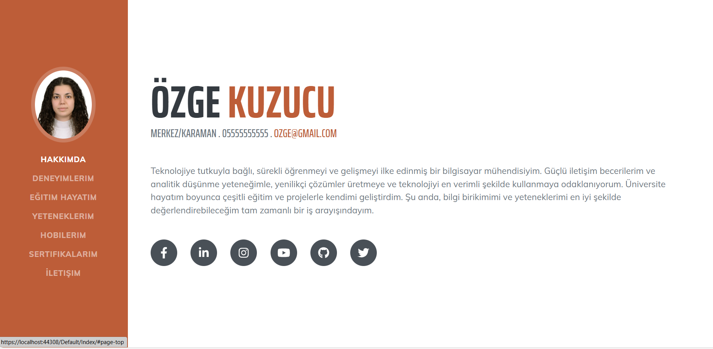
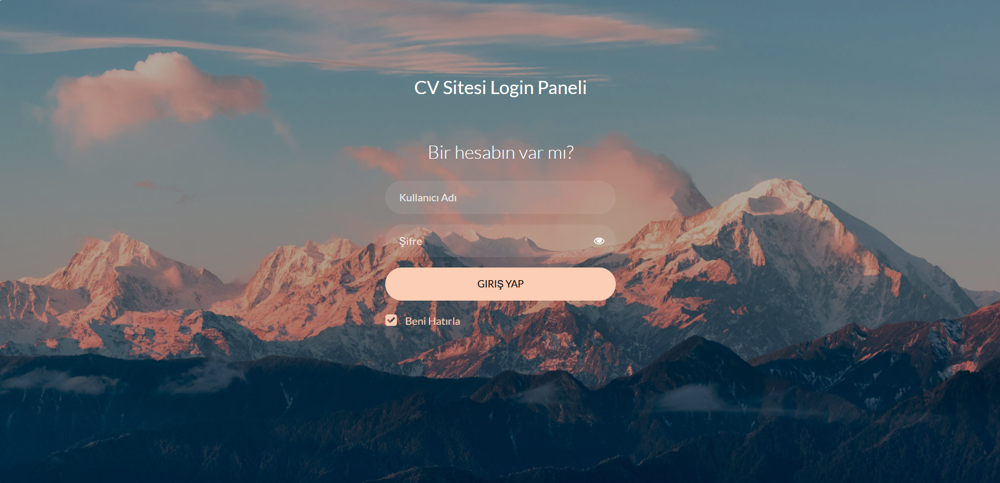
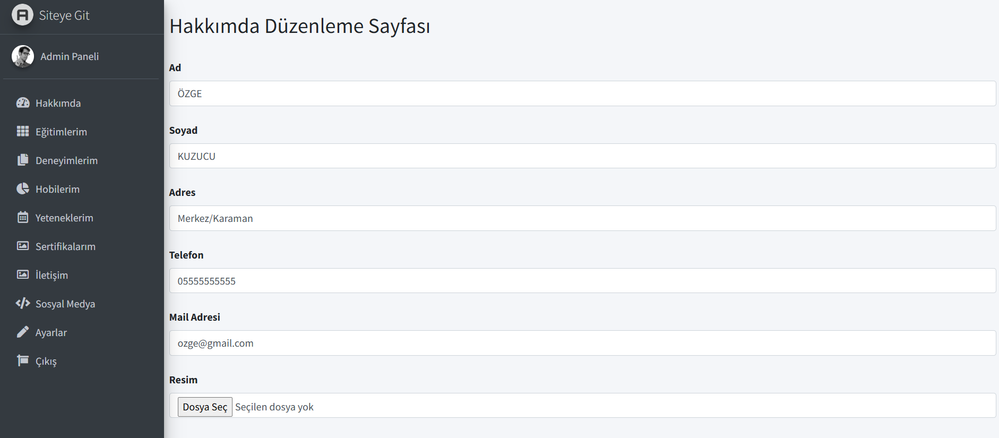
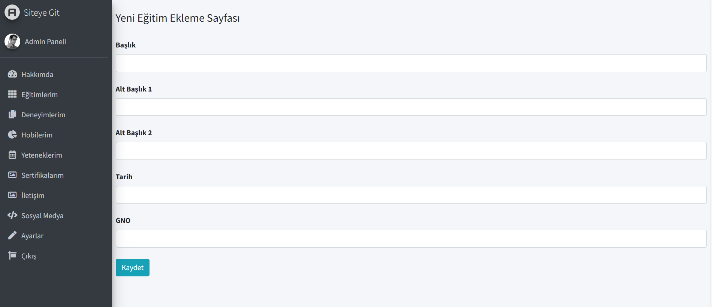
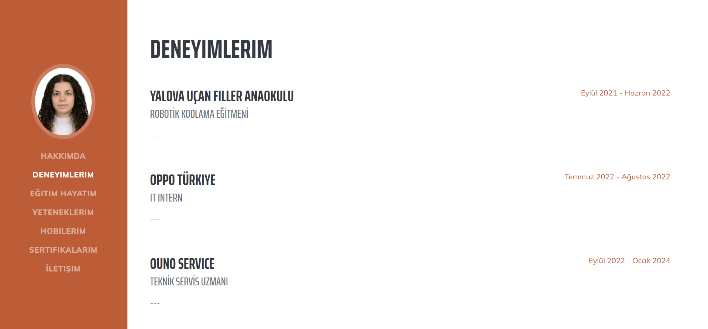
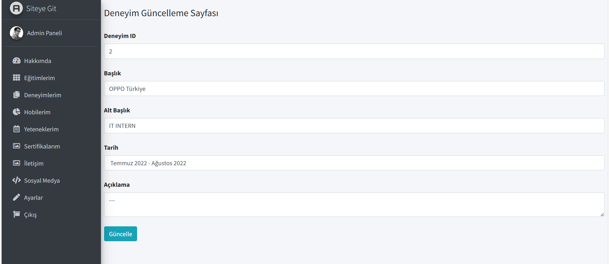
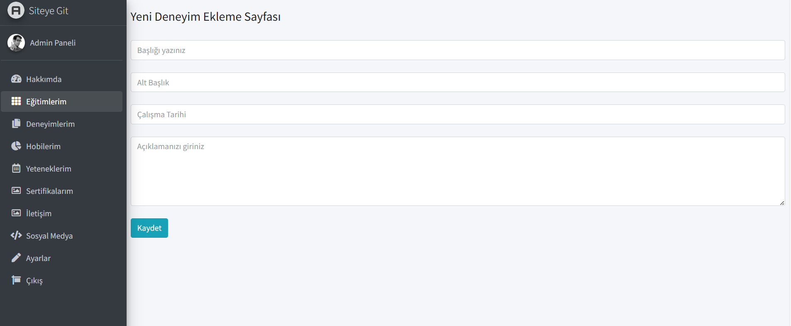
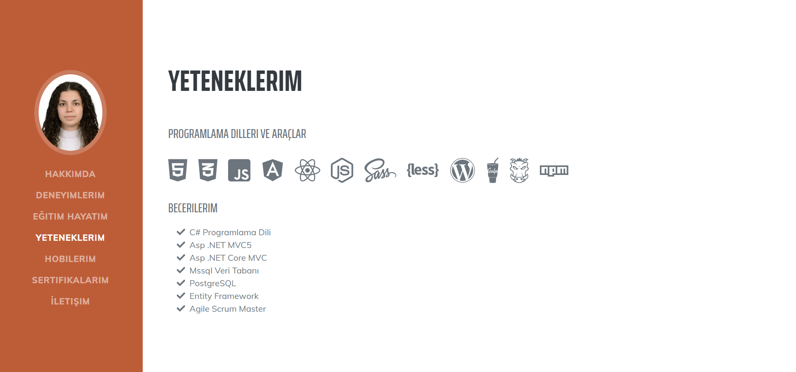
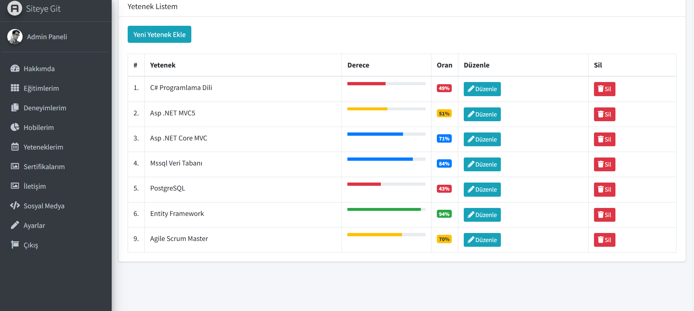
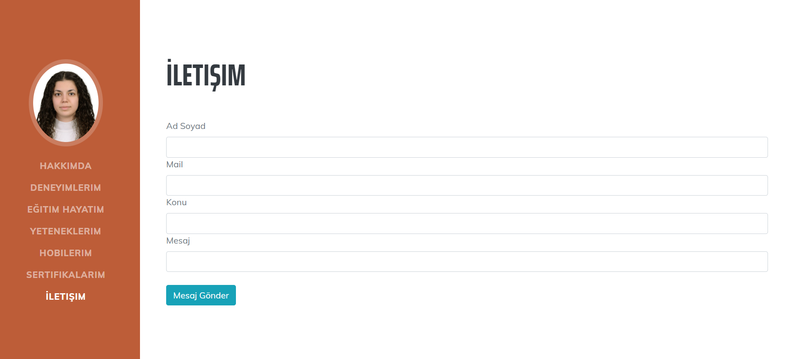

# 🧑‍💻 MVC5 ile Admin Panelli Dinamik CV Sitesi

Bu proje, ASP.NET MVC5 mimarisi kullanılarak geliştirilmiş **dinamik bir CV web sitesidir**. Yönetici paneli aracılığıyla tüm içerikler (eğitimler, deneyimler, yetenekler, sosyal medya bağlantıları vb.) kolayca yönetilebilir.

---

## 📌 Proje Özeti

Proje iki ana kısımdan oluşur:

- **Kullanıcı Arayüzü (CV Sitesi)**: Ziyaretçilere kişisel bilgiler, deneyimler, eğitim geçmişi gibi CV içerikleri gösterilir.
- **Yönetici Paneli (Admin Panel)**: CRUD işlemleriyle tüm içerikler veritabanı üzerinden yönetilebilir.

---

## ⚙️ Kullanılan Teknolojiler

- ASP.NET MVC5
- Entity Framework (Db-First)
- MS SQL Server
- LINQ
- HTML5 / CSS3 / JavaScript
- Bootstrap (Responsive Tasarım)

---

## 🛠️ Özellikler

### 🔐 Giriş Paneli
- Giriş yapan kullanıcılar admin paneline erişebilir.
- Giriş yapılmadan sadece CV ve giriş sayfalarına ulaşılabilir.

### 👤 Hakkımda
- Kişisel bilgiler güncellenebilir.

### 🎓 Eğitimler
- Eğitim geçmişi listelenebilir, güncellenebilir, silinebilir ve yeni kayıt eklenebilir.

### 💼 Deneyimler
- İş deneyimleri yönetilebilir.

### 🎯 Yetenekler
- Yetenek listesi, yüzde bar ile birlikte gösterilir.
- Yeni yetenek eklenebilir, güncellenebilir ve silinebilir.

### 📜 Sertifikalar
- Sertifikalar eklenebilir, düzenlenebilir ve silinebilir.

### 🎨 Hobiler
- Hobiler kısmı admin paneli güncellenebilir.

### 🌐 Sosyal Medya
- Sosyal medya hesapları aktif/pasif olarak yönetilir.
- Yalnızca aktif olan hesaplar kullanıcı arayüzünde görünür.

### 📬 İletişim Formu
- Ziyaretçiler iletişim formu ile mesaj gönderebilir.
- Gelen mesajlar admin panelinde görüntülenebilir.

### 🔓 Çıkış
- Kullanıcı çıkış yaptığında tekrar giriş yapmadan panele ulaşamaz.
